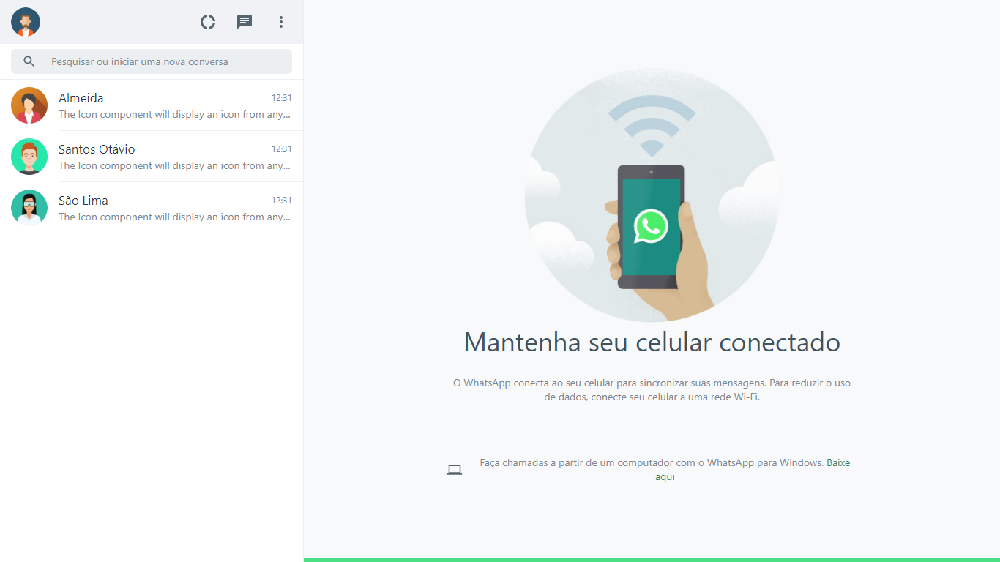

# Whatasap Clone
  Clone da interface do Whatasap.
  
## Screenshots
<div align="center">
    
    
    
    
  </div>
  
 ## Pré-requisitos

Antes de iniciar o projeto será necessário ter instalado na máquina o Nodejs, e algum gerenciador de pacotes, nesse projeto foi utilizado o npm.

## Roadando a aplicação no Windows

```bash
# Clone este repositório
$ git clone https://github.com/ezequias21/whatasap-clone.git

# Acesse a pasta do projeto no terminal/cmd
$ cd whatsap-clone

# Instale as dependências
$ npm install

# Inicie um servidor local de desenvolvimento
$ npm start

# O servidor inciará na porta 3000 - acesse <http://localhost:3000>
```

 ## Tecnologias
 
 - [React](https://pt-br.reactjs.org/)
